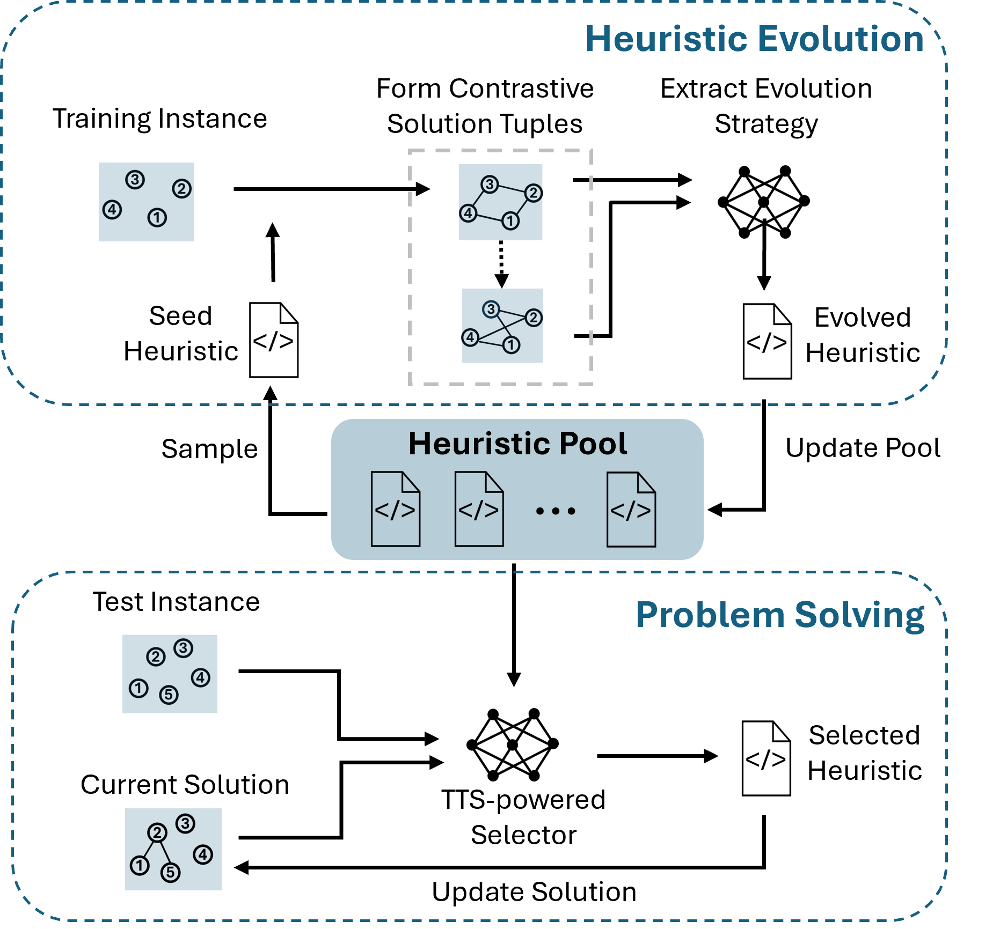

# HeurAgenix

## Introduction
HeurAgenix is a novel framework based on LLM, designed to generate, evolve, evaluate, and select heuristic algorithms for solving combinatorial optimization problems. It leverages the power of large language models to autonomously handle various optimization tasks with minimal human intervention. This framework ensures high adaptability, flexibility, and performance in solving both classical and novel optimization problems.



## Prepare

### Set up environment
To set up the environment, run the following command:
```bash
pip install -r requirements.txt
```

### Set up LLM
Currently, the framework supports GPT from Azure using tokens and api based model.

1. Fill in the parameters in `src/util/azure_gpt_setting.json` / `src/util/azure_gpt_setting.json`.
2. Test the LLM activation using:
```bash
python chat.py
```

### Prepare Data
#### Data for Classical CO Problem
Data sources and formatting requirements for TSP, CVRP, JSSP, MaxCut, and MKP are detailed in the respective readme files.

| Problem                             | Data Source                                                                                     | Readme Link                                           |
|-------------------------------------|-------------------------------------------------------------------------------------------------|-------------------------------------------------------|
| Traveling Salesman Problem (TSP)    | [TSPLIB](http://comopt.ifi.uni-heidelberg.de/software/TSPLIB95/tsp/)                            | [TSP data readme](src/problems/tsp/data/README.md)    |
| Capacitated Vehicle Routing Problem (CVRP) | [VRPLIB](http://vrp.galgos.inf.puc-rio.br/index.php/en/)                                       | [CVRP data readme](src/problems/cvrp/data/README.md)  |
| Job Shop Scheduling Problem (JSSP)  | [OR-library](https://people.brunel.ac.uk/~mastjjb/jeb/orlib/files/)                          | [JSSP data readme](src/problems/jssp/data/README.md)  |
| Maximum Cut Problem (MaxCut)        | [OPTSICOM](https://grafo.etsii.urjc.es/optsicom/maxcut.html#instances)                          | [MaxCut data readme](src/problems/max_cut/data/README.md) |
| Multidimensional Knapsack Problem (MKP) | [OR-library](https://people.brunel.ac.uk/~mastjjb/jeb/orlib/files/)                            | [MKP data readme](src/problems/mkp/data/README.md)    |

#### Data For DPOSP
To generate the data for the Dynamic Production Order Scheduling Problem (DPOSP, new in paper):
1. Modify the parameters (production line num, order num, production rate distribution, etc.) in `src/problems/dposp/data/generate_data.py` file.
2. Run the following command:
    ```bash
    python src/problems/dposp/data/generate_data.py
    ```
3. Refer to the [DPOSP data readme](src/problems/dposp/data/README.md).

#### Data Structure
By default, data is stored in `output/{problem}/data/(train_data, validation_data, test_data, smoke_data)`. If data is stored elsewhere, specify the path when running the framework.  
  
- **Train Data**: Used by LLM to analyze problems during heuristic evolution. Typically consists of small instances either manually designed or sampled from the data.  
- **Validation Data**: Used for evaluating and filtering heuristics during evolution.  
- **Test Data**: Used for testing heuristics or heuristic selection.  
- **Smoke Data**: Used for quick testing of generated or evolved heuristics to check for obvious bugs. Usually consists of small, manually designed instances and includes `previous_operations.txt` (pre-operations for the test) and `smoke_data` (test data).  
  
For example, a common TSP data structure is as follows:  
output/
tsp/
data/
smoke_data/: previous_operations.txt, smoke_data.tsp
test_data/: a280.tsp, bier127.tsp, ...
train_data/: case_1.tsp, case_2.tsp, ...
validation_data/: kroA100.tsp, kroA150.tsp, ...

Our built-in data reading interface can handle the standard data format above. If your data is in a new format, you need to override the `load_data` function in `env.py`.  

## Run on Current Problems (TSP, CVRP, JSSP, MaxCut, MKP, and DPOSP)

### Generate Heuristic
#### Prepare
- **Smoke Data (Optional)**: If you enable the smoke test for the generate heuristic part. Smoke data should include two types of files:
    - **Instance Data**: The format should be consistent with other data.
    - **previous_operations.txt (Optional)**: This file records the pre-operations for the smoke test, with each line representing a pre-operation. If not provided, it means there are no pre-operations.

#### Run the Heuristic Generation
To generate heuristics, use the following command:

```bash
python generate_heuristic.py -p <problem> -s <source> [-m] [-pp <paper_path>] [-r <related_problems>]
```

- `-p`, `--problem`: Specifies the type of CO problem to solve (required). Choose from available options in the `problem_pool`.
- `-s`, `--source`: Defines the source for generating heuristics (required), with options:
  - `llm`: Use LLM’s internal knowledge.
  - `paper`: Extract heuristics from a specified research paper.
  - `related_problem`: Transfer heuristics from related CO problems.
- `-m`, `--smoke_test`: Runs a smoke test (optional).
- `-pp`, `--paper_path`: Path to the LaTeX paper file or directory, used only when the source is `paper`.
- `-r`, `--related_problems`: A comma-separated list of related problems to reference, default is `"all"`.
The generated heuristics are saved in the `output/{problem}/generate_heuristic` folder.

#### Examples
To generate heuristics for the Traveling Salesman Problem (TSP) using LLM with a smoke test:
```bash
python generate_heuristic.py -p TSP -s llm -m
```

To generate heuristics from a paper:
```bash
python generate_heuristic.py -p TSP -s paper -pp "path_to_paper.tex"
```

To transfer heuristics from related problems for a new problem:
```bash
python generate_heuristic.py -p NewProblem -s related_problem -r "CVRP,TSP,JSSP,..."
```

### Evolve Heuristic
#### Prepare
- **Smoke Data (Optional)**: If you enable the smoke test for the generate heuristic part, you need to provide smoke data in the `src/problems/{problem}/data/smoke_data` folder.
- **Train Data**: Training data should be small-scale instances to enhance the results. You can sample smaller data from the data source or create small data instances yourself.
- **Validation Data (Optional)**: If you enable the validation for the evolution heuristic part, you need to provide validation data. If validation is not enabled, this step is not necessary.

#### Running Heuristic Evolution
Run the heuristic evolution process using:

```bash
python evolution_heuristic.py -p <problem> -be <basic_heuristic> [-t <train_dir>] [-v <validation_dir>] [-pe <perturbation_heuristic>] [-pr <perturbation_ratio>] [-pt <perturbation_time>] [-i <max_refinement_round>] [-f <filter_num>] [-r <evolution_rounds>] [-l <time_limit>] [-m]
```

Parameters:
- `-p`, `--problem`: Specifies the CO problem type to solve (required).
- `-e`, `--basic_heuristic`: Path or name of the basic heuristic to evolve (required).
- `-t`, `--train_dir`: Directory for training data (default: output/{problem}/data/train_data).
- `-v`, `--validation_dir`: Directory for validation data (default: output/{problem}/data/validation_data).
- `-pe`, `--perturbation_heuristic`: Path or name of the heuristic used for perturbations.
- `-pr`, `--perturbation_ratio`: Ratio for perturbation adjustments (default: 0.1).
- `-pt`, `--perturbation_time`: Maximum perturbation count (default: 1000).
- `-r`, `--max_refinement_round`: Number of refinement rounds (default: 5).
- `-f`, `--filter_num`: Number of heuristics to retain after validation (default: 1).
- `-r`, `--evolution_rounds`: Number of rounds for heuristic evolution (default: 3).
- `-l`, `--time_limit`: Time limit for running the evolution (default: 10 seconds).
- `-m`, `--smoke_test`: Optional flag to run a smoke test.

The evolved heuristics are saved in the `output/{problem}/evolution_result` folder.

####  Example
To evolve heuristics for a Traveling Salesman Problem (TSP) using a basic heuristic with smoke test:
```bash
python evolution_heuristic.py -p TSP -e nearest_neighbor_f91d -m -t train_data -v validation_data
```

### Generate Feature Extractors
#### Prepare
- **Smoke Data (Optional)**: If you enable the smoke test for the generate heuristic part, you need to provide smoke data in the `src/problems/{problem}/data/smoke_data` folder.

#### Running Feature Extractor Generation
Run the following command to generate feature extractors:

```bash
python generate_feature_extractor.py -p <problem> [-m]
```

Parameters:
- `-p`, `--problem`: Specifies the type of problem for which to generate the feature extractor (required).
- `-m`, `--smoke_test`: Optional flag to perform a smoke test on the generated extractor.
The process and resulting extractor function will be saved in the `output/{problem}/generate_evaluation_function` folder.

#### Example
To generate a feature extractor for a Traveling Salesman Problem (TSP) with a smoke test:
```bash
python generate_feature_extractor.py -p TSP -m
```


### Run Single Heuristic and Heuristic Selector

Execute a specified heuristic or enable dynamic heuristic selection for the chosen problem.

#### Preparation
- **Test Data**: Place test data.
- **Feature Extractors and Heuristics**: Ensure feature extractors and heuristics are available. Pre-generated extractors and heuristics are included, or you can generate them following the **Generate Feature Extractors** and **Generate Heuristic** sections.

#### Running Heuristics
Run the following command with the required parameters to apply a heuristic or heuristic selector:

```bash
python launch_hyper_heuristic.py -p <problem> -e <heuristic> [-d <heuristic_dir>] [-c <test_case>] [-t <test_dir>] [-r]
```

The execution results and generated trajectories (if `-r` is specified) will be saved in the `output/{problem}/test_result` folder.

Parameters:
- `-p`, `--problem`: Specifies the type of problem to solve (required).
- `-e`, `--heuristic`: Specifies the heuristic function. Options include:
  - `<heuristic_function_name>`: Directly specify the name of a particular heuristic function.
  - `'llm_hh'`: LLM-based rapid selection from heuristics in the specified directory.
  - `'llm_deep_hh'`: LLM-based comprehensive selection from heuristics in the specified directory.
  - `'random_hh'`: Randomly selects a heuristic from the directory.
  - `'or_solver'`: Uses an exact OR solver (only applicable for specific problems like DPOSP).
- `-d`, `--heuristic_dir`: Directory containing heuristic functions (if needed).
- `-c`, `--test_case`: Path to a single test case.
- `-t`, `--test_dir`: Directory containing the entire test set (Optional, default: output/{problem}/data/test_data).

#### Example
To run the nearest neighbor heuristic on a test case:
```bash
python launch_hyper_heuristic.py -p TSP -e nearest_neighbor_f91d -c path/to/test_case
```
To run the rapid heuristic selection on a test case:
```bash
python launch_hyper_heuristic.py -p TSP -e llm_hh -c path/to/test_case
```
To run the comprehensive heuristic selection on a test case:
```bash
python launch_hyper_heuristic.py -p TSP -e llm_deep_hh -c path/to/test_case
```

## Solving On New Problems
HeurAgenix excels in addressing new problems. When faced with a new problem, the following steps are required:
- Implement an `Env` class in `src/problems/{problem}/env.py` based on [BaseEnv](src/problems/base/env.py) to provide basic support for algorithm execution, including `load_data`, `init_solution`, `get_global_data`, `get_state_data`, and `validation_solution` functionalities.
- Implement a `Solution` class based on [BaseSolution](src/problems/base/component.py) and an `Operation` class based on [BaseOperation](src/problems/base/component.py) in `src/problems/{problem}/component.py` to record solutions and modifications.
- Create the following prompt files in `src/problems/{problem}/prompt`:
    - `problem_description.txt` to describe the new problem.
    - `global_data.txt` to describe the storage format of the instance data for the problem.
    - `state_data.txt` to describe the format of the solution for the problem.
    - `special_remind.txt` (optional) for specific reminders related to the problem during algorithm generation.
- If an OR algorithm is needed as an upper bound, implement the `ORSolver` class in `src/problems/{problem}/or_solver.py`.

## Visualize the Project Workflow  
  
To explore the project's workflow visually without executing the actual processes, you can use the Streamlit application. This tool provides an interactive way to understand the framework's components and flow.  
  
To launch the visualization interface, run the following command:  
  
```bash  
streamlit run doc/app.py
```
 
This command will open a web-based interface where you can visually navigate through the project's architecture and processes. Please note that this visualization is for demonstration purposes only and does not perform any actual optimization tasks.

